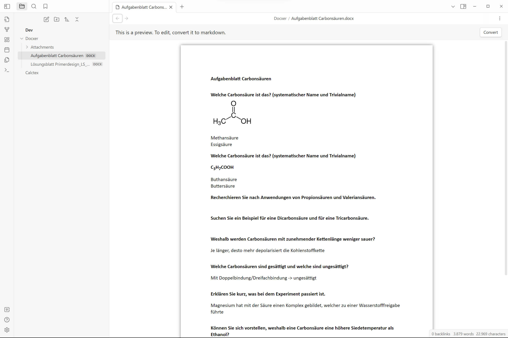
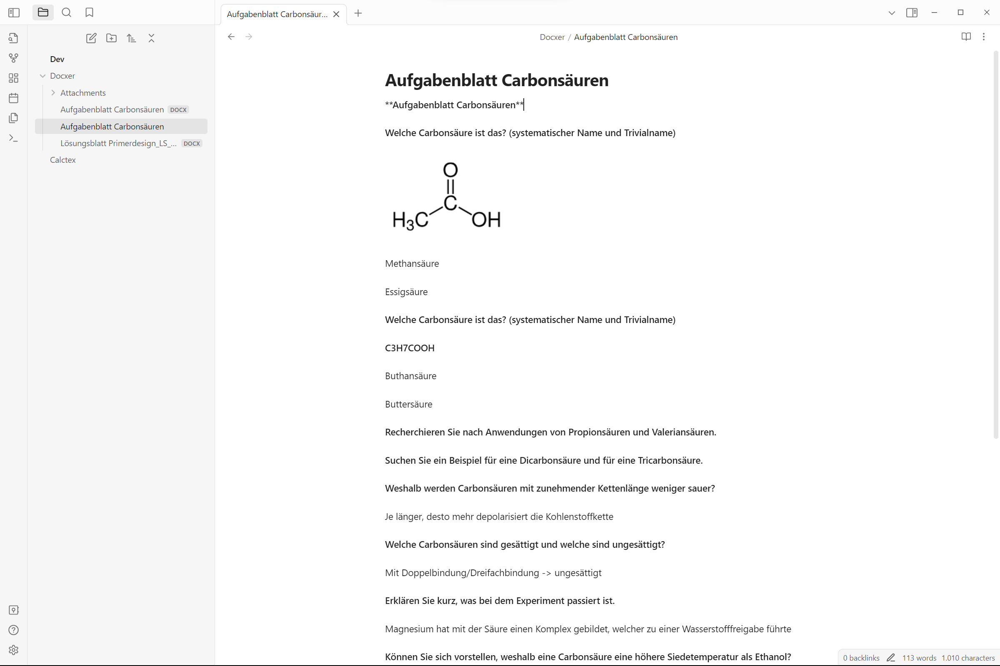
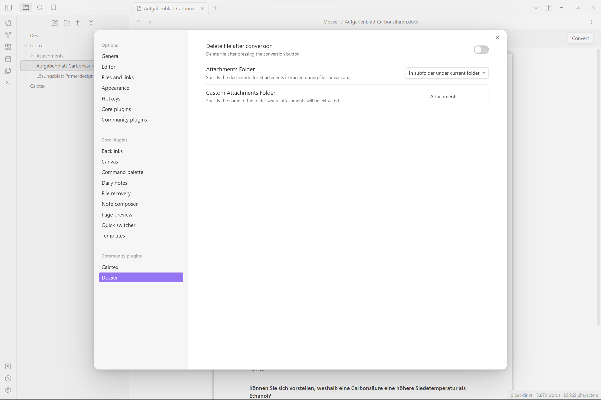

# Docxer
An [Obsidian](https://obsidian.md/) plugin that allows you to import and convert .docx files into markdown files. This plugin also adds a preview for .docx files.

## Usage
1. Add a .docx file to your vault.
2. Open the file in Obsidian.
3. Click the "Convert" button in the top right corner of the editor to convert the file to markdown.

## Screenshots

## Installation
~~Download it from the community plugins list~~ (coming soon)
OR
1. Download the files from the latest release from the releases page.
2. Put the files into `<vault>/.obsidian/plugins/docxer`.
3. Reload Obsidian and enable the plugin in the settings.
4. Enjoy!
