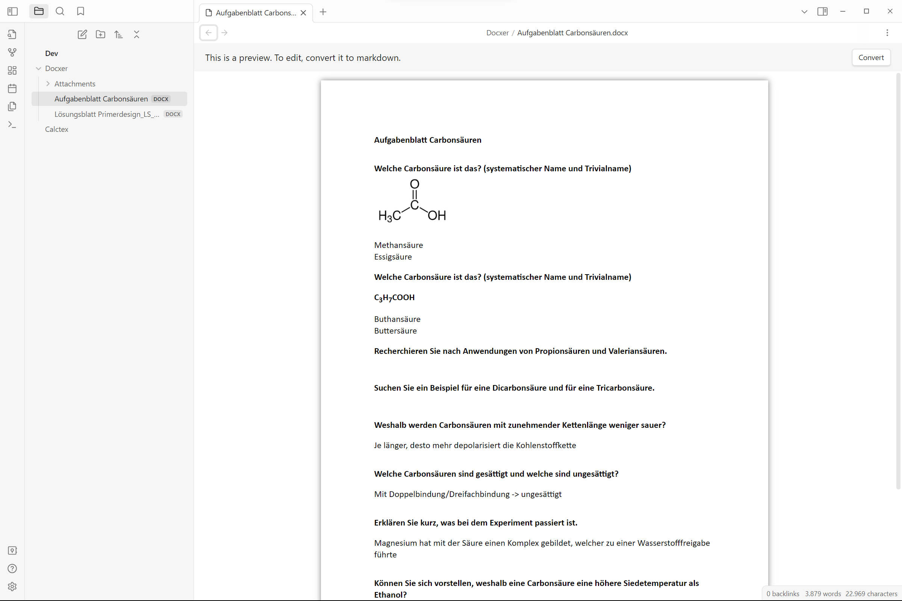
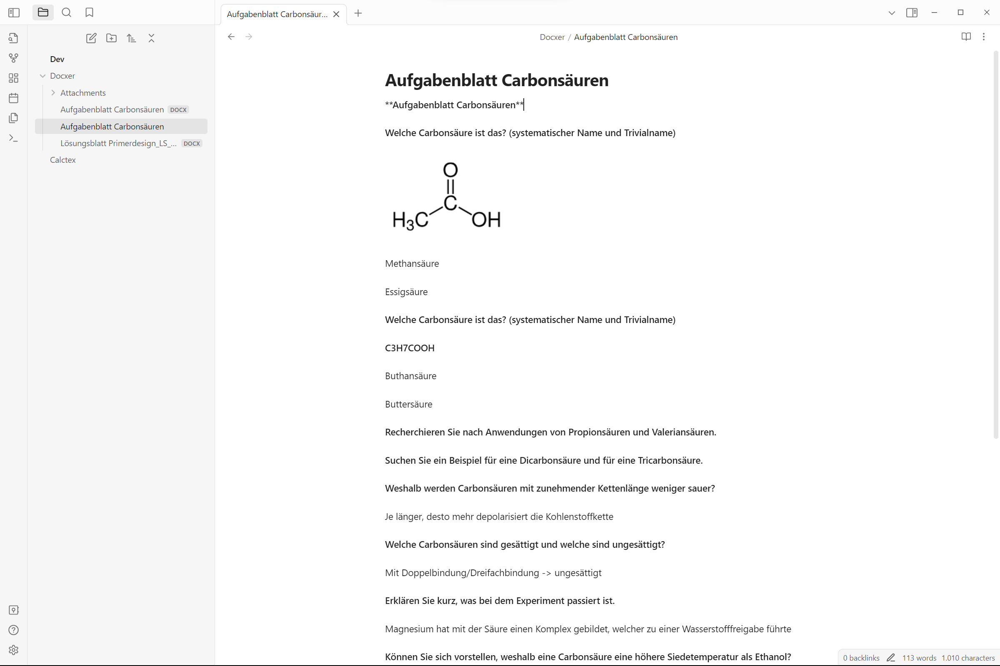

<h3 align="center">
    <picture>
        <source media="(prefers-color-scheme: dark)" srcset="./assets/logo-dark.svg">
        
    </picture>  
	Docxer for <a href="https://obsidian.md">Obsidian.md</a>
</h3>

    
    
    
     
	
    
      
    <b>🚀 Boost</b> your productivity by previewing and converting Word files easily to markdown.

## Installation
Open the Community Plugins tab in the settings and search for "Docxer" (or click [here](https://obsidian.md/plugins?id=docxer)).

    
Other installation methods

     
    <ul>
        <li>Install it using <a href="https://github.com/TfTHacker/obsidian42-brat">BRAT</a></li>
        <li>Manual folder creation
            <ol>
                <li>Create a folder named <code>obsidian-docxer</code> in your vault's plugins folder (<code>&lt;vault&gt;/.obsidian/plugins/</code>).</li>
                <li>Download <code>main.js</code>, <code>styles.css</code> and <code>manifest.json</code> from the latest release and put them in the <code>obsidian-docxer</code> folder.</li>
                <li>Enable the plugin in Settings -> Community plugins -> Installed plugins</li>
            </ol>
        </li>
    </ul>

## Usage
1. Add a .docx file to your vault.
2. Open the file in Obsidian.
3. Click the "Convert" button in the top right corner of the editor to convert the file to markdown.

## Support
Please consider supporting the plugin. The two easiest ways to support the plugin are either by starring ⭐ the repository or by donating any amount on [Ko-fi](https://ko-fi.com/X8X27IA08) ❤️. Thank you!

## Screenshots

## Contributing
All contributions are welcome! Here's how you can help:
- Create a fork of the repository
- Create a branch with a descriptive name
- Make your changes
- Debug the plugin using `npm run dev`
- Create a pull request
- Wait for the review
